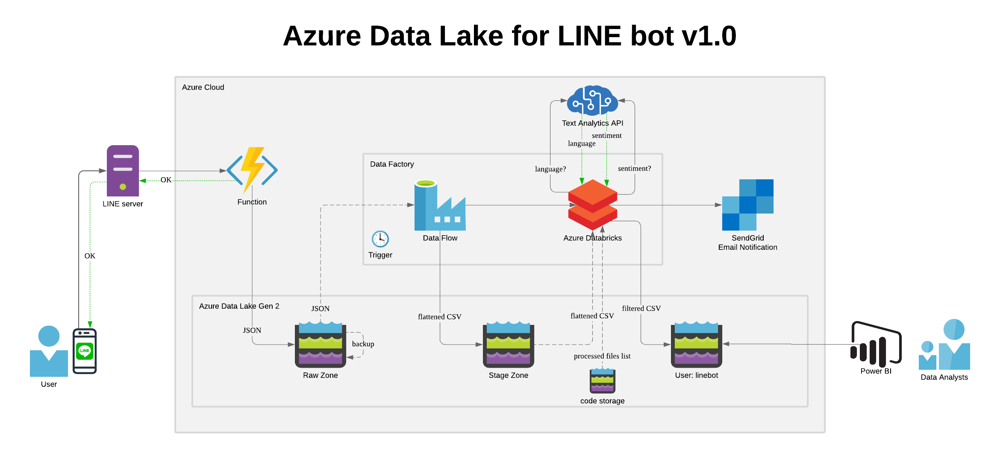
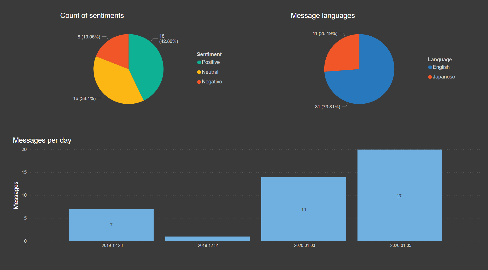
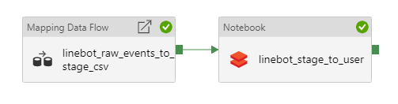
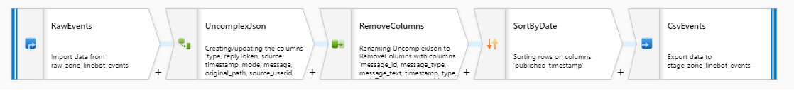

# Data lake for LINE bot messages on Azure Cloud v1.0
This is a sample project created while studying capabilites of Microsoft Azure Cloud services.  
The goal was to create a data lake on Azure that resembles the one I'm working with on AWS but that is also modified for better interactivity.  

## Project requirements
The only requirements set by this project are:
* Successfully receive message data from a LINE bot
* Transform and store messages information
* Add sentiment analysis to messages' text
* Enable analytics via PowerBI

Everything in between was being constantly rethought and redesigned, and uses different components (like processing data in data factory flow via 2 different methods).

# Project architecture and flow

1. User sends a message to LINE bot `AzureDataLakeBot`
2. Message goes through LINE server to Azure Function app that performs 2 steps:
    1. Stores JSON message information received from LINE server in data lake's Raw zone in JSON format
    2. Replies back to the user via bot with "Message processed" message
3. Data factory is triggered manually (or set to trigger on time). Data factory pipeline consists of 2 steps: 
    * **Mapping Data Flow** for Raw zone -> Stage zone processing
    * **Azure Databricks notebook** (PySpark) for Stage zone -> User storage processing
4. Data flow takes each message's JSON data from Raw zone, flattens nested nodes, combines into one CSV file and puts the file into Stage zone. It also moves the data in Raw zone from `linebot` folder to `backup-linebot` folder
5. Data factory proceeds to Azure Databricks notebook step
6. Azure Databricks notebook runs following procedures:
    * Reads CSV files from Stage zone into a PySpark dataframe
    * Filters dataframe to only have necessary columns for users
    * Requests language detection for each message's text from Text Analytics API and adds response information to dataframe
    * Requests sentiment detection for each message's text from Text Analytics API and adds response information to dataframe
    * Puts data into User storage as CSV files
    * Sends notification on completion via SendGrid
7. Users query data directly from User storage on data lake via PowerBI

## Final output example

# Additional information
Function script (Python): `function.py`  
Databricks notebook (PySpark): `stage_to_user_linebot.ipynb`  
Data Factory pipeline:  
  
Mapping Data Flow:

# To-do
* Secure data lake (use Azure Key Vault, audit role permissions etc)
* Refactor code to include:
    * Checks for exceptions where necessary
    * Check for text message length when sending message to Text Analytics API
* Tune sentiment categories judgement (especially for Japanese language)
* Re-architecture certain parts of data lake for scalability (store data in parquet format, reimagine data factory trigger etc)
* Implement thorough logging flow
* Implement data lifecycle management